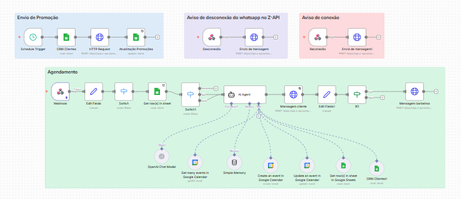

## 💈 Assistente Inteligente de Agendamentos para Barbearias

Sistema de Automação com IA para Agendamentos

Sistema de automação inteligente desenvolvido para atender clientes e gerenciar agendamentos de barbearias de forma automática utilizando n8n, APIs e Inteligência Artificial.

O objetivo é reduzir trabalho manual, agilizar respostas e criar uma experiência de atendimento fluida e automatizada.

## ✨ Destaques

Atendimento automático de clientes 24/7

Agendamento de horários sem intervenção humana

Interpretação de mensagens com Inteligência Artificial

Fluxo 100% automatizado com n8n

Integração com WhatsApp via webhooks

## 🚀 O que este sistema faz

Este sistema funciona como um assistente virtual para barbearias, conduzindo o atendimento do cliente desde a primeira mensagem até a confirmação do agendamento.

A IA interpreta o pedido, verifica horários disponíveis e realiza a marcação automaticamente.

## 🔄 Arquitetura do sistema

Canal de mensagem (WhatsApp / Chat)

→ Webhook (n8n)

→ IA (interpretação da mensagem e intenção)

→ Verificação de disponibilidade (agenda/API)

→ Criação do agendamento

→ Confirmação para o cliente

## 🧠 Funcionalidades principais

Automação completa de agendamentos

Interpretação de linguagem natural com IA

Lógica inteligente de horários

Integração com APIs e webhooks

Fluxos automatizados no n8n

Respostas em tempo real

## 🛠️ Tecnologias utilizadas

n8n (automação de workflows)

APIs REST

Webhooks

Modelos de Inteligência Artificial (LLMs)

Integrações com agenda/calendário

## ⚙️ Como funciona

Cliente envia uma mensagem solicitando agendamento

O webhook recebe a mensagem no n8n

A IA interpreta a intenção do cliente

O sistema verifica horários disponíveis

O agendamento é criado automaticamente

O cliente recebe a confirmação

## 🎯 Impacto no negócio

Redução do trabalho manual da recepção

Menos erros em agendamentos

Atendimento mais rápido

Aumento na taxa de conversão de agendamentos

Escalabilidade sem necessidade de equipe adicional

## 📸 Demonstração

### 🔧 Fluxo de automação no n8n  

Visão do fluxo completo de automação, desde o recebimento da mensagem até a confirmação do agendamento.

---

### 💬 Atendimento automatizado  

Exemplo real da IA conduzindo a conversa com o cliente e finalizando o agendamento automaticamente.

## 💼 Para quem é este sistema

Barbearias

Salões de beleza

Clínicas

Negócios baseados em agendamento

Pequenas empresas que querem automatizar atendimento

## 📌 Resumo do projeto

Este projeto demonstra como IA + automação podem substituir tarefas manuais repetitivas e transformar o processo de agendamento em algo totalmente automático, rápido e escalável.
